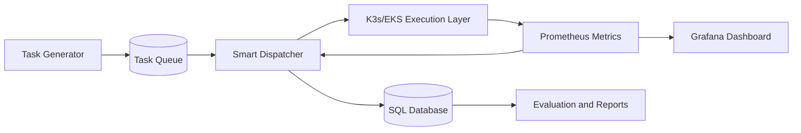

# Hybrid Edge-Cloud Architecture (Week 1)

## 1. Objective

Build an end-to-end backend architecture for intelligent task dispatching:

- ingest generated tasks
- observe system metrics
- choose execution target (Edge/Cloud)
- store decisions and task outcomes for training/evaluation

## 2. High-Level Components

- Task Generator (`workload/task_generator.py`)
- Smart Dispatcher (planned in Week 2, `dispatcher/smart_dispatcher.py`)
- Metrics Source (Prometheus)
- Execution Layer (K3s edge cluster + cloud node)
- Persistence Layer (SQLite/PostgreSQL)
- Monitoring Dashboard (Grafana)

## 3. Data Flow

1. Task Generator creates incoming tasks (`task_id`, `arrival_time`, `cpu_requirement`, `deadline_ms`, etc.).
2. Dispatcher pulls live metrics from Prometheus.
3. Dispatcher builds normalized state vector and selects an action.
4. Dispatcher sends task to `edge_1`, `edge_2`, or `cloud`.
5. Execution status and timing are written to database.
6. Decision records are stored for training analysis and report metrics.

## 4. Logical Diagram



## 5. Dispatcher Interfaces (Week 1 Contract)

### 5.1 Input task schema

```json
{
  "task_id": "task_000001",
  "arrival_time": "2026-04-02T10:00:00Z",
  "cpu_requirement": 0.5,
  "ram_requirement_mb": 512,
  "deadline_ms": 300,
  "priority": "medium",
  "payload_type": "compute"
}
```

### 5.2 Decision output schema

```json
{
  "task_id": "task_000001",
  "selected_node": "edge_1",
  "action": 0,
  "decision_latency_ms": 8.7,
  "state_vector_version": "v1",
  "policy_name": "dqn"
}
```

## 6. Database Design

Core tables:

- `tasks`: lifecycle and execution status
- `decisions`: model/policy decisions linked to tasks
- optional view-level analytics created later in Week 3/4

Detailed DDL is in `database/schema.sql`.

## 7. Deployment Topology (Current Plan)

- Edge VM 1: `edge_1`
- Edge VM 2: `edge_2`
- Cloud node: `cloud`

Action mapping standard:

- `0 -> edge_1`
- `1 -> edge_2`
- `2 -> cloud`

## 8. Non-Functional Targets

- Dispatcher decision latency: < 20 ms (excluding execution)
- End-to-end success rate: > 95%
- Full observability for SLA, latency, and cost metrics

## 9. Week 1 Deliverable Check

- [x] Architecture overview and data flow
- [x] Component interfaces defined
- [x] Deployment topology clarified (2 edge + 1 cloud)
- [x] Database schema linked
