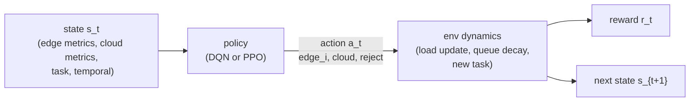

# MDP Design for Hybrid Edge-Cloud Task Dispatching

## 1. Problem Statement

Goal: learn a dispatch policy that selects the best execution target for each incoming task in a hybrid system with n edge nodes and one cloud node (default experiments use 2 edges).

Primary objectives:

- minimize end-to-end task latency
- maximize SLA compliance (meet deadline)
- control resource and compute cost

## 2. Agent, Environment, and Time Step

- Agent: scheduler policy (DQN or PPO)
- Environment: abstracted edge-cloud system state
- One step: one incoming task decision

## 3. MDP Diagram

## 4. Action Space

Discrete action space of size `n_edge_nodes + 2`:

- actions `0..n_edge_nodes-1`: dispatch to `edge_i`
- action `n_edge_nodes`: dispatch to `cloud`
- action `n_edge_nodes + 1`: reject (drop task)

Notes:

- For 2-edge-1-cloud: `0 -> edge_1`, `1 -> edge_2`, `2 -> cloud`, `3 -> reject`.
- Baseline policies never choose `reject` (RL only).

## 5. State Space (17 dimensions for 2 edges, `4n + 9` in general)

State vector at step `t` (order matches implementation):

1. `edge1_cpu` in [0, 1]
2. `edge1_ram` in [0, 1]
3. `edge1_latency` in [0, 1]
4. `edge1_queue` in [0, 1]
5. `edge2_cpu` in [0, 1]
6. `edge2_ram` in [0, 1]
7. `edge2_latency` in [0, 1]
8. `edge2_queue` in [0, 1]
9. `cloud_cpu` in [0, 1]
10. `cloud_ram` in [0, 1]
11. `cloud_latency` in [0, 1]
12. `cloud_queue` in [0, 1]
13. `task_cpu_demand` in [0, 1]
14. `task_ram_demand` in [0, 1]
15. `task_deadline` in [0, 1]
16. `hour_sin` in [0, 1]
17. `hour_cos` in [0, 1]

Normalization references (uncalibrated env):

- CPU, RAM: percent / 100
- queue length: value / queue_max (queue_max = 20)
- latency: ms / latency_max (latency_max = 200)
- deadline: ms / deadline_max (deadline_max = 500)
- temporal: `(sin/cos + 1) / 2`

Calibrated env uses latency_max = 30000 and deadlines in [2000, 30000] ms.

## 6. Transition Dynamics (High-level)

After action selection:

- if `reject`, do not update load and apply fixed penalty
- otherwise estimate latency, cost, and SLA for the selected node
- update node load and queue for the selected node
- decay queues and add small noise to metrics
- sample a new task and build the next state

## 7. Reward Design

Reward in code uses smooth SLA signal with latency and cost penalties.

$$
latency\_norm = \frac{latency}{latency\_max}, \quad cost\_norm = \frac{cost}{CLOUD\_COST\_PER\_UNIT \cdot 110}
$$

$$
slack = \frac{deadline - latency}{\max(deadline, 1)}, \quad sla\_signal = \tanh(3 \cdot slack)
$$

$$
R_t = -0.5 \cdot latency\_norm - 0.2 \cdot cost\_norm + 0.5 \cdot sla\_signal - 0.5 \cdot \mathbb{1}[\text{SLA miss}]
$$

If `reject`, then $R_t = -0.5$.

## 8. Baseline Policies for Comparison

Implemented in `rl_env/baseline_policies.py`:

- Random
- RoundRobin
- LeastConnection (least CPU load)
- EdgeOnly
- CloudOnly
- Threshold heuristic

These baselines provide non-RL references for report comparisons and never pick `reject`.

## 9. Evaluation Metrics

Mandatory metrics:

- average latency
- P95 latency
- SLA compliance rate
- average cost per task
- deadline miss rate

Additional metrics:

- policy decision distribution
- node utilization profile

## 10. Training Plan

Phase 1 (fast validation):

- train DQN first to validate environment and reward shaping

Phase 2 (model selection):

- train PPO and compare against DQN and baselines

Selection rule:

- choose best model by SLA first, then latency, then cost

## 11. Week 1 Deliverable Checklist

- [x] action/state/reward formalization documented
- [x] baseline policy set defined and implemented
- [x] evaluation metrics defined
- [x] training algorithm plan (DQN + PPO comparison)
